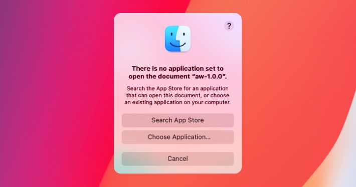
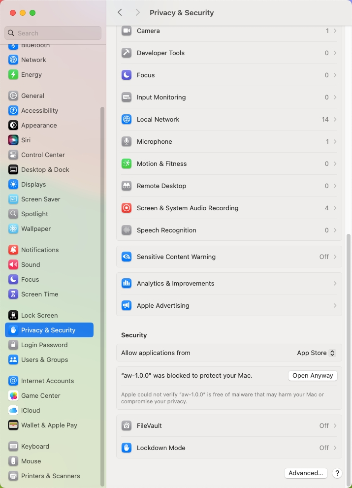
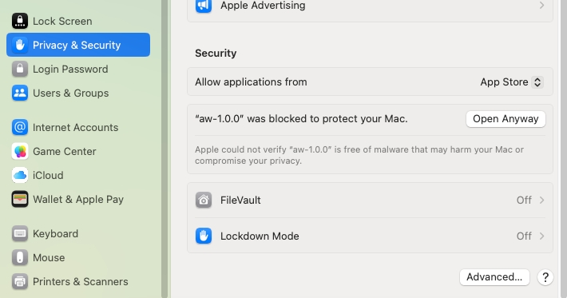

# Application execution

> Directly download the AW client in [dist](https://github.com/earos-ai/aw-client/tree/master/dist). format to run AW nodes, without needing to use the command line below (which is intended for technical users

## Windows

Download the aw client in **[exe](https://github.com/earos-ai/aw-client/tree/master/dist)**.

## Mac

Download the aw client in **[aw-mac](https://github.com/earos-ai/aw-client/tree/master/dist)**.

### First unzip the downloaded file

Double-click the `.zip` package to unzip the file

### Troubleshooting File Opening Issues on macOS

If you encounter situations where a aw cannot be opened or is being blocked (as shown in the picture), you may need to adjust your settings. This issue occurs because the application is not distributed through the App Store.



#### Resolution Steps

1. **Open System Preferences:**
   - Navigate to **Privacy & Security**.
   

2. **Access Security Settings:**
   - Within the **Privacy & Security** panel, scroll to the **Security** section. 

3. **Locate the Application:**
   - Find the "aw-1.0.0" in the list of blocked

4. **Allow the Application:**
   - Click on **Open Anyway** to bypass the block and open the file.

> **Note:** This configuration is necessary because macOS security settings restrict applications not available via the App Store.

## Linux

> Support: `ubuntu20.04+`、`debian11+`、`fedora39+`

Download the aw client in **[aw-linux](https://github.com/earos-ai/aw-client/tree/master/dist)**.

```shell
unzip aw-linux-1.0.0.zip
./aw
```

# Command line run

## 1.Install Git

> To install git-lfs as an additional tool, check out (https://git-lfs.com/)

### Windows

Go to the Git official website(https://git-scm.com/downloads/win) to download the specified version of Git for installation.

### Mac

```shell
/bin/bash -c "$(curl -fsSL https://raw.githubusercontent.com/Homebrew/install/HEAD/install.sh)"
brew install git git-lfs
```
### Linux

#### Debian/Ubuntu

For the latest stable version for your release of Debian/Ubuntu

```
# apt-get install git git-lfs
```

For Ubuntu, this PPA provides the latest stable upstream Git version

```
# add-apt-repository ppa:git-core/ppa
# apt update; apt install git git-lfs
```

#### Fedora

`# yum install git git-lfs` (up to Fedora 21)
`# dnf install git git-lfs` (Fedora 22 and later)

#### Gentoo

```
# emerge --ask --verbose dev-vcs/git
```

#### Arch Linux

```
# pacman -S git
```

#### openSUSE

```
# zypper install git
```

#### Mageia

```
# urpmi git
```

#### Nix/NixOS

```
# nix-env -i git
```

#### FreeBSD

```
# pkg install git
```

#### Solaris 9/10/11 ([OpenCSW](https://www.opencsw.org/))

```
# pkgutil -i git
```

#### Solaris 11 Express, OpenIndiana

```
# pkg install developer/versioning/git
```

#### OpenBSD

```
# pkg_add git
```

#### Alpine

```
$ apk add git git-lfs
```

#### Red Hat Enterprise Linux, Oracle Linux, CentOS, Scientific Linux, et al.

RHEL and derivatives typically ship older versions of git. You can [download a tarball](https://www.kernel.org/pub/software/scm/git/) and build from source, or use a 3rd-party repository such as [the IUS Community Project](https://ius.io/) to obtain a more recent version of git.

#### Slitaz

```
$ tazpkg get-install git
```

## 2.Build virtual environment

### Windows
#### Step 1: Download and Install Python 3.9
Navigate to the Python Downloads Page :
Open your web browser and go to the official Python website: python.org/downloads
#### Step 2: Install virtualenv
```
pip install virtualenv
```
#### Step 3: Create a Virtual Environment
```
\your\python3.9version\path\python -m venv venv
```
#### Step 4: Activate the Virtual Environment
```
venv\Scripts\activate
```

### Mac

#### Apple Silicon

```shell
mkdir -p ~/miniconda3
curl https://repo.anaconda.com/miniconda/Miniconda3-latest-MacOSX-arm64.sh -o ~/miniconda3/miniconda.sh
bash ~/miniconda3/miniconda.sh -b -u -p ~/miniconda3
rm ~/miniconda3/miniconda.sh
```

#### Intel

```shell
mkdir -p ~/miniconda3
curl https://repo.anaconda.com/miniconda/Miniconda3-latest-MacOSX-x86_64.sh -o ~/miniconda3/miniconda.sh
bash ~/miniconda3/miniconda.sh -b -u -p ~/miniconda3
rm ~/miniconda3/miniconda.sh
```

### Linux

#### Linux x86

```shell
mkdir -p ~/miniconda3
wget https://repo.anaconda.com/miniconda/Miniconda3-latest-Linux-x86_64.sh -O ~/miniconda3/miniconda.sh
bash ~/miniconda3/miniconda.sh -b -u -p ~/miniconda3
rm ~/miniconda3/miniconda.sh
```

#### AWS Graviton2/ARM64

```shell
mkdir -p ~/miniconda3
wget https://repo.anaconda.com/miniconda/Miniconda3-latest-Linux-aarch64.sh -O ~/miniconda3/miniconda.sh
bash ~/miniconda3/miniconda.sh -b -u -p ~/miniconda3
rm ~/miniconda3/miniconda.sh
```

#### IBMZ/LinuxOne/s390x

```shell
mkdir -p ~/miniconda3
wget https://repo.anaconda.com/miniconda/Miniconda3-latest-Linux-s390x.sh -O ~/miniconda3/miniconda.sh
bash ~/miniconda3/miniconda.sh -b -u -p ~/miniconda3
rm ~/miniconda3/miniconda.sh
```

## 3.Start running the node 

### Windows
```
venv\Scripts\activate
git clone https://github.com/earos-ai/aw-client \your\project\path\aw-node
cd \your\project\path\aw-node
pip install -r requirements.txt
python aw.py
```


### Mac or Linux

```shell
source ~/miniconda3/bin/activate
conda create -y -n aw-node python==3.10
conda activate aw-node
git clone https://github.com/earos-ai/aw-client /root/aw-node
cd /root/aw-node
pip install -r requirements.txt
python aw.py
```
